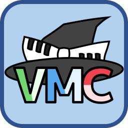

# バーチャルモーションキャプチャー (VirtualMotionCapture)

VR機器やmocopiを使ってVRMのアバターを動かすことが出来る、VTuberやアバターで活動するすべての方のためのアプリです。  
VRゲームと同時に起動して、VRゲームの中にアバターで入ったような撮影をしたり、  
頭や両手にトラッカーを装着して、アバターで配信を行ったり、  
mocopiを使って全身を動かした映像を制作したり、アバターで何かする時のためのツールです。

VMCProtocol (バーチャルモーションキャプチャープロトコル)に対応しているので、  
豊富な対応アプリ( <https://protocol.vmc.info/Reference> )と組み合わせて、フェイストラッキングや、グローブ型デバイスの動きを受信して組み合わせたり、  
動きをVRゲームに送信したり、Unityに持ち込んでアバターを動かしたりと活用の幅は無限大です。

> ※「バーチャルモーションキャプチャー」は登録商標です。
  
**公式サイト**: <https://vmc.info/>  
**マニュアル**: <https://vmc.info/manual/>  
ダウンロード・詳しい説明書・よくある質問は公式サイトをご覧ください。

---

## 主な機能

- **VRM 1.0 / VRM 0.x 両対応** のアバター読み込み（ライセンス表示・同意フロー付き）
- **VR ゲームと同時起動** ／ 3〜11点のフルボディトラッキング
  - 頭・胸・両手・腰・両足・両肘・両膝に、HMD / コントローラー / トラッカーを自由に割り当ててキャリブレーション
- **表情制御**: リップシンク、自動まばたき、ハンドジェスチャー、ショートカットキー、パーフェクトシンク
- **アイトラッキング**: Tobii / VIVE Pro Eye (SRanipal)、および LookAt（視線）
- **モーション再生・記録**: VRMA / BVH の読み込み再生、収録・書き出し（フレームレート指定、部位ごとの適用切り替え）
- **VMCProtocol / OSC** の送受信によるアプリ間連携
- **VRoid Hub 連携**（VRM 1.0 対応・アバター一覧の読み込み）
- **仮想 Web カメラ出力** と **写真撮影**（高解像度・背景透過）
- **LIV / externalcamera.cfg / VMT（バーチャルモーショントラッカー）** による合成・カメラ制御
- **MIDI 入力**
- **mocopi 連携**
- 多言語 UI（日本語 / English / 中文 / 한국어）

## 動作環境

- Windows 10 / 11（64-bit）
- SteamVR に対応した VR 機器（HTC Vive、Valve Index、Oculus / Meta、WinMR、HaritoraXなど）や、mocopi などのトラッキング機器
  - VR 機器なしでも起動でき、VMCProtocol / OSC 受信や外部モーション連携に利用できます
- フルボディトラッキングにはトラッカー（VIVE Trackerなど）を推奨

## インストール

1. [BOOTH のダウンロードページ](https://sh-akira.booth.pm/items/999760) または本リポジトリの Releases から `VirtualMotionCapture-x.xx.zip` を入手します。
2. 展開して `VirtualMotionCapture.exe` を実行します。

> アンチウイルス（avast 等）にブロックされる場合は [documents/avast.md](documents/avast.md) を参照してください。

## 基本的な使い方

1. 起動するとコントロールパネルが表示されます。
2. **VRM読み込み** から任意の VRM モデルを開き、表示されるライセンスに同意します。
3. ウインドウを閉じて **キャリブレーション** を実行し、画面の指示に従います。
4. コントローラーに合わせて **ショートカットキー設定** のプリセットを選びます（既定は HTC Vive 用。Oculus Touch などは対応プリセットに変更）。

アバター表示画面はマウスで操作できます。

| 操作 | 動作 |
| --- | --- |
| ホイール | ズーム |
| 右ドラッグ | カメラ移動 |
| 左ドラッグ | ウインドウ移動 |
| Alt + ホイール | 滑らかなズーム |

## ソースからのビルド

### 必要なもの

- **Unity 2022.3.76f1**
- **Visual Studio 2022**（「.NET デスクトップ開発」ワークロード）

### 手順

1. 本リポジトリをクローンします。
2. Unity 2022.3.76f1 でプロジェクトを開きます。
   - **UniVRM**（`com.vrmc.vrm` 0.131.0）と **MIDI入力の Minis**（`jp.keijiro.minis`）は UPM / OpenUPM 経由で `Packages/manifest.json` から自動的に取得されます。
   - MIDI入力は Minis（Unity Input System ベース）を使用します。プロジェクトの Active Input Handling は **Both**（`activeInputHandler: 2`）に設定済みで、初回に Input System を有効化するための再起動を求められる場合があります。
3. サードパーティ製アセット／SDK は再配布できないため、リポジトリには含まれていません。必要に応じて各自でインポートし、`Assets/ExternalPlugins/` 以下に配置してください。
   - [Final IK](https://assetstore.unity.com/packages/tools/animation/final-ik-14290)（`RootMotion`）
   - [SteamVR Plugin](https://github.com/ValveSoftware/steamvr_unity_plugin/releases)（OpenVR XR プラグインを含む）
   - [Oculus Lipsync Unity Integration](https://developer.oculus.com/downloads/package/oculus-lipsync-unity/)
   - [uOSC](https://github.com/hecomi/uOSC)
   - [EasyDeviceDiscoveryProtocolForUnity](https://github.com/gpsnmeajp/EasyDeviceDiscoveryProtocolForUnity)
   - [mocopi Receiver Plugin for Unity](https://www.sony.net/Products/mocopi-dev/)
   - アイトラッキング対応時: [VIVE SRanipal SDK](https://developer.vive.com/resources/vive-sense/eye-and-facial-tracking-sdk/)
   - アイトラッキング対応時: [Tobii Unity SDK](https://developer.tobii.com/pc-gaming/unity-sdk/)（インポート後、フォルダは移動しないでください）
   - VRoid Hub 連携時: VRoid SDK（[VRoid SDK for Unity](https://vroid.com/sdk)）

   > アイトラッキングが不要な場合は、`Assets\Scripts\Avatar\EyeTracking` フォルダと `Assets\Scripts\Avatar\LipTracking` フォルダを削除してください。
4. コントロールパネル（`ControlWindowWPF/ControlWindowWPF.sln`）を Visual Studio 2022 で開きます。
   - `VirtualMotionCaptureControlPanel` プロジェクトのプロパティを開き、デバッグのコマンドライン引数を `/pipeName VMCTest` に設定します。
   - Visual Studio でそのまま一度開始すると、exe が自動生成されます。開いたコントロールパネルは閉じて一度終了します。
   - 共有ライブラリ（UnityMemoryMappedFile）は、このソリューションのビルド時に `Assets/ExternalPlugins/UnityMemoryMappedFile` へ自動コピーされます。
5. Unity をもう一度起動し、`Assets/Scenes` の `VirtualMotionCapture` シーンを開いて実行します。
6. Visual Studio でコントロールパネルを開始して接続します。

### exe のビルド手順

1. 上記の通常デバッグ手順を完了します。
2. Unity の Build Settings で `UnityBuild` フォルダに対してビルドします。
3. `ControlWindowWPF` で **BETA** 構成のビルドを行います。
4. `ControlWindowWPF/ControlWindowWPF/bin/BETA` に一式が生成されます。

> **VRoid SDK について**: VRoid SDK が無くてもビルドは通ります。`Assets/VRoidSDK/` に SDK を配置すると、エディタ拡張が自動的にスクリプト定義 `VMC_VROIDSDK` を有効化し、VRoid Hub 連携が組み込まれます（SDK 本体はリポジトリに含まれません）。

## ライセンス

本体のソースコードは [MIT License](LICENSE) です。  
同梱・連携する各サードパーティ製アセット／SDK には、それぞれのライセンスが適用されます。

## リンク・お問い合わせ

- 公式サイト: <https://vmc.info/>
- マニュアル: <https://vmc.info/manual/>
- よくある質問（Wiki）: <https://github.com/sh-akira/VirtualMotionCapture/wiki>
- X (Twitter): [@sh_akira](https://twitter.com/sh_akira)

## 支援

- [BOOTH](https://sh-akira.booth.pm/items/999760)
- [pixivFANBOX](https://www.pixiv.net/fanbox/creator/10267568)
- [Patreon](https://www.patreon.com/sh_akira)
- [Amazon](https://t.co/KPJRzn6sVR)

---

アプリ名の命名は [ねこます](https://twitter.com/kemomimi_oukoku) さんによるものです。
