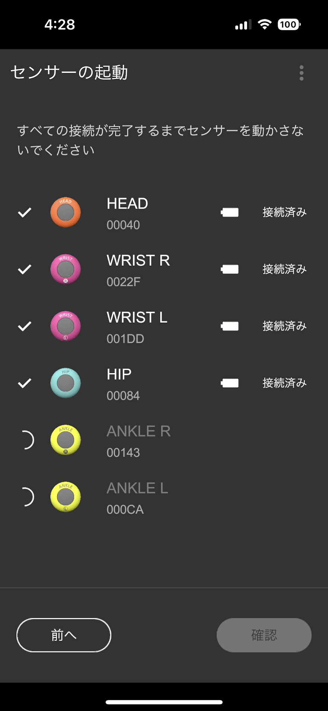
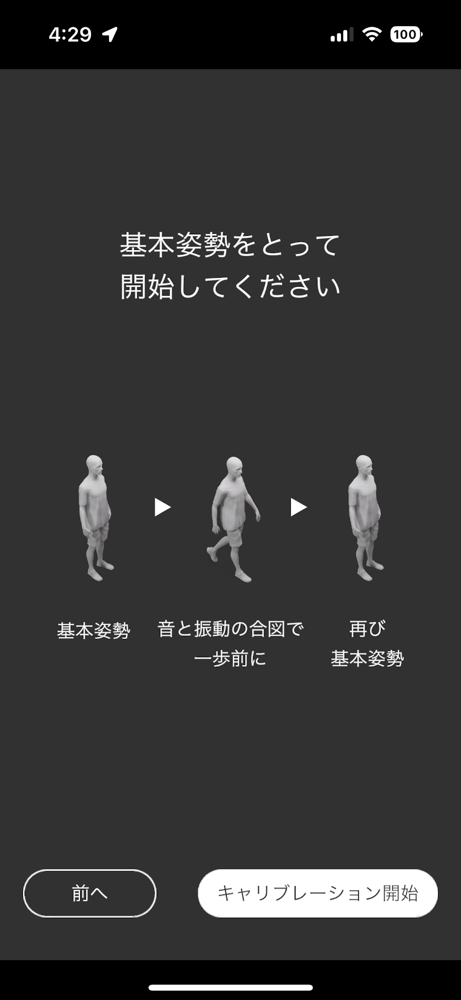
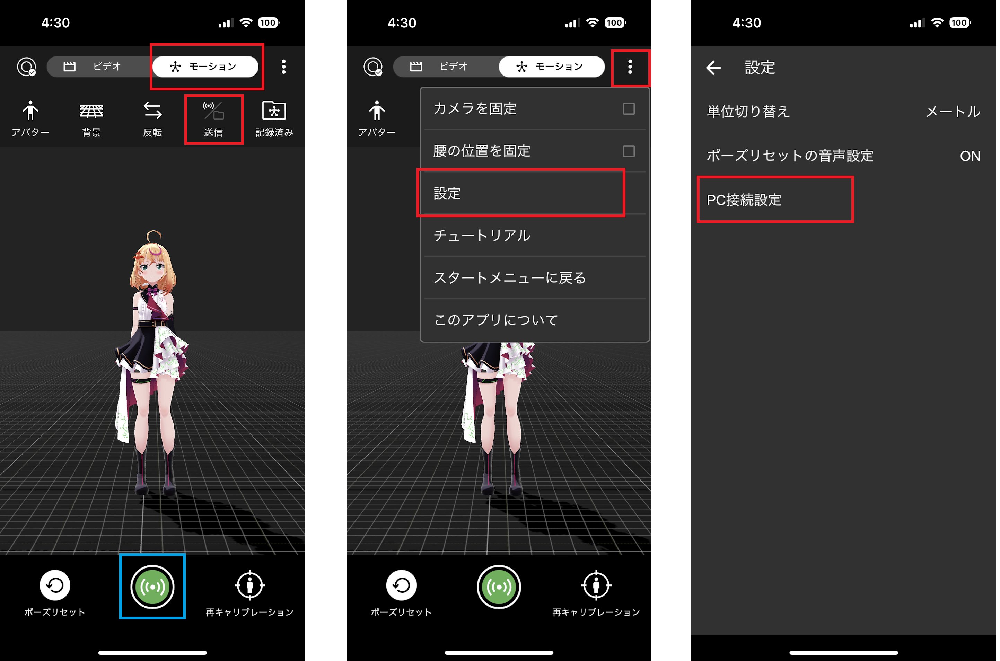
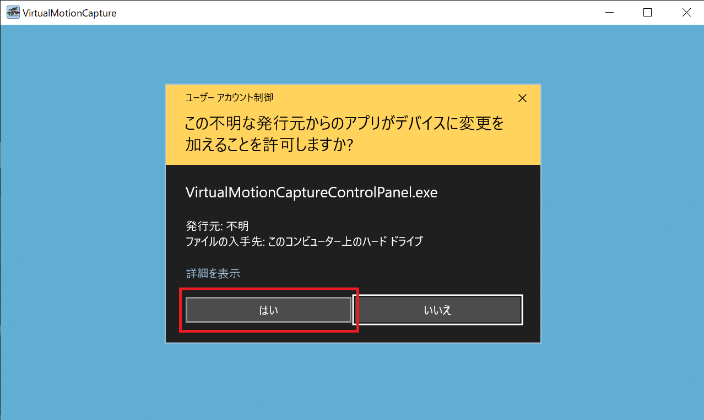
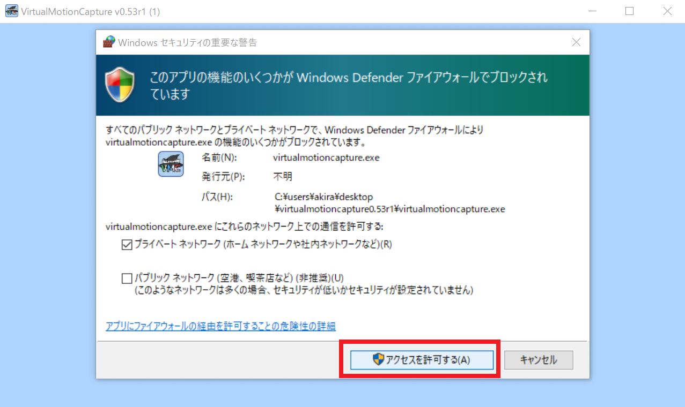
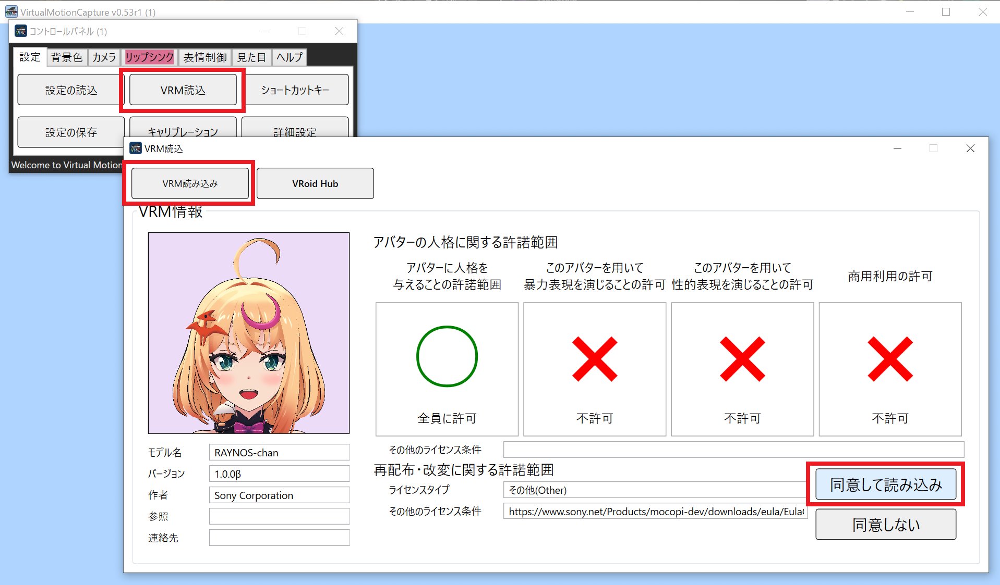
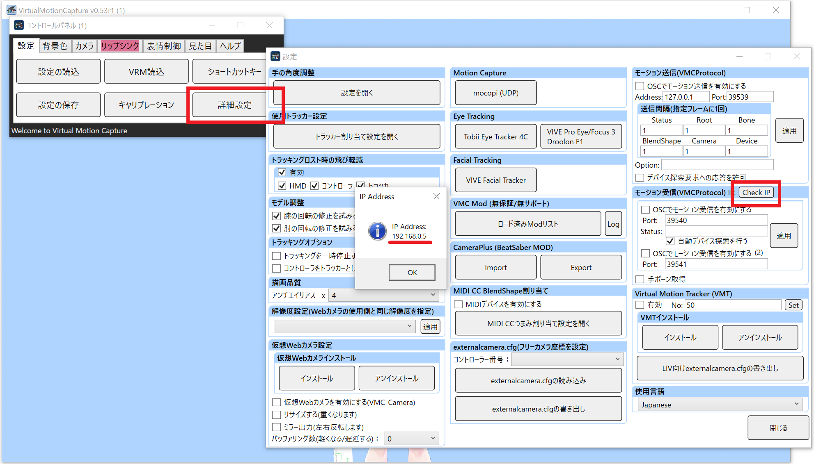
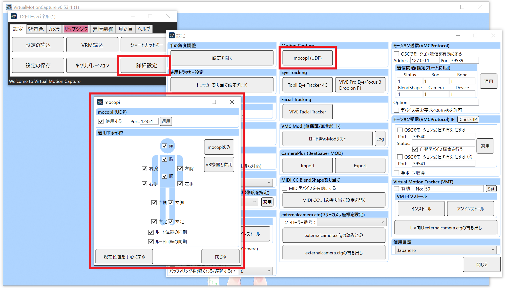
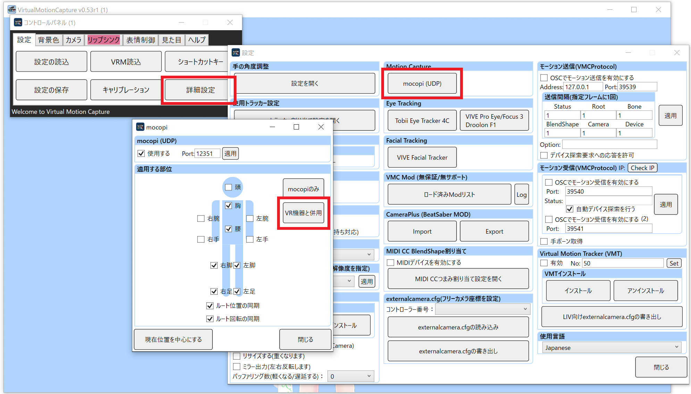
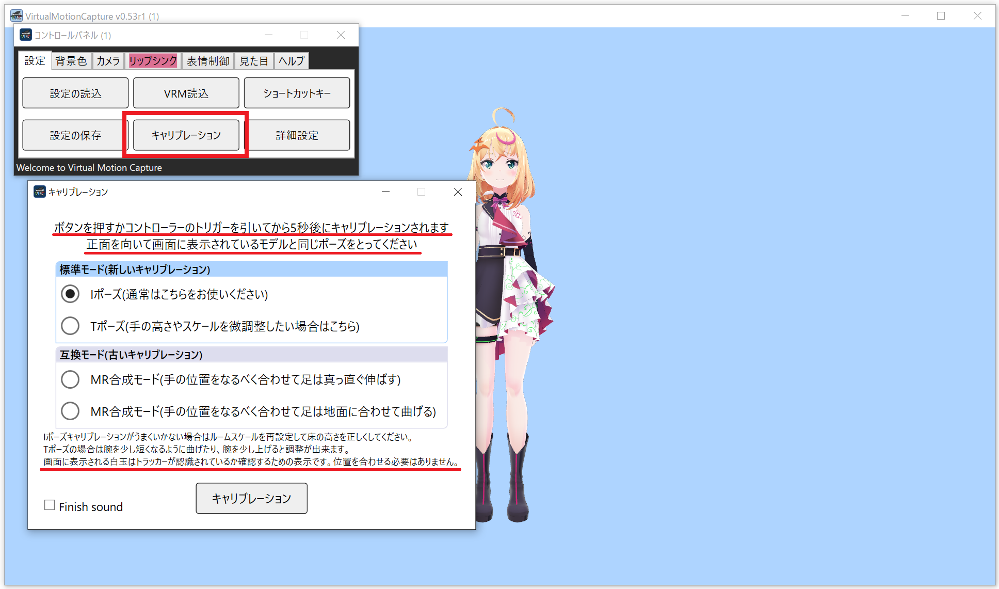

バーチャルモーションキャプチャーでmocopiを使う  

# mocopi

[モバイルモーションキャプチャー mocopi（モコピ）](https://www.sony.jp/mocopi/)はソニー株式会社が販売する、ちいさくて、かるい、モーションキャプチャーデバイスです。  
バーチャルモーションキャプチャー(ばもきゃ)はmocopiの公式対応アプリです。  
  
このページではバーチャルモーションキャプチャーにおけるmocopiの使い方を説明します。

***

# mocopiの起動とキャリブレーション

まずはmocopiを起動し、画面に従ってセンサーを起動、接続を行います。  
  
  
  
**センサーの接続中は静止状態を精密に計測しているので、パソコンの振動などがない場所に置いて完了するまで動かさないようにします。**    
しっかりと静止したまま接続が完了するのを確認してから、体に装着するようにします。    
  
次にキャリブレーションを行います。  
  
  
  
手は体の横に付けてなるべく揺れないようにします。足は軽く肩幅程度開いてまっすぐ立ちます。  
  
# mocopiをモーション送信モードにする

  
  
上部の「モーション」を選び、「保存/送信」切り替えボタンで送信モードにします。  
右上メニューボタンから「設定」を開きます。  
設定内から「PC接続設定」を開きます。  
  
  
  
バーチャルモーションキャプチャーを動かすPCのIPアドレスを入力します。  
IPアドレスの確認方法は後述します。  

# バーチャルモーションキャプチャーを起動する

  
  
初めてばもきゃを起動するとファイアウォールの設定を変更するために、確認画面が表示されるので「はい」を押します。  

  
  
mocopiと通信するためにファイアウォールの設定を行いますので、「OK」を押します。  
※もし過去に拒否してしまい、再表示したい場合は、ばもきゃフォルダのSettings/commonWPF.jsonファイルを削除して再起動すると、再度表示されます。  

  
  
起動したらアバターを読み込みます。今回はソニーから配布されているmocopiの公式キャラクターRAYNOSちゃんを使用します。  
[RAYNOSちゃんAvatarダウンロードページ](https://www.sony.net/Products/mocopi-dev/jp/downloads/DownloadInfo.html#RAYNOS)からVRMモデルをダウンロードし、  
コントロールパネルの「VRM読込」ボタンを押し、「VRM読み込み」ボタンで、ダウンロードしたVRMモデルを開いたら「同意して読み込み」を押します。  
  
  
  
コントロールパネルの「詳細設定」を押し、「Check IP」ボタンを押すとIPアドレスが表示されます。例：192.168.0.5  
スマホのmocopiアプリにこのIPアドレスを設定します。  
  
  
  
これでmocopiの設定は完了です。mocopiアプリ下部の緑色のボタンを押して送信を開始すれば、アバターが動きます。  
カメラタブで、「フリー」を選択し、「正面リセット」を押すとカメラを固定して動き回れるようになります。   

# mocopiの詳細設定をする

  
  
「詳細設定」の「mocopi (UDP)」ボタンでmocopiの詳細設定が表示されます。  
ポートの変更、受信する部位の個別選択、中心位置のリセット等が可能です。  

# mocopiをVR機器と併用する

上半身にVR機器、下半身を動かすのにmocopiを使用できます(mocopiは6点全て装着する必要があります)。  
  
  
  
「詳細設定」の「mocopi (UDP)」ボタンでmocopiの詳細設定を表示します。  
「VR機器と併用」ボタンを押すとVR用の設定に一発で変更できます。  
  
  
  
HMDとコントローラーを装着し、コントロールパネルから「キャリブレーション」を押して、  
画面の注意事項に従ってキャリブレーションを行います。  
  
これで完了です。VR機器と併用時におかしな動きをする場合は、詳細設定のトラッカー割り当て画面でHMDとコントローラーが認識していることと、腰や足に不要なトラッカーが割り当てられていないか確認してください。分からない場合は頭と両手以外全て「割り当てしない」に設定してください。
